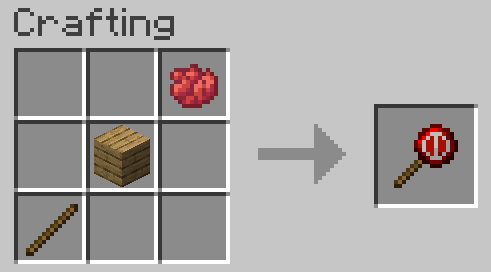

# hands-off
Minecraft mod that allows you to stop villagers from claiming your beds and job blocks.

## Usage

To mark POI blocks as offlimits to villagers, the Block Marker tool must be used. Simply hold the tool and right-click on the desired block. The recipe to craft the tool is:

Any items tagged as `forge:dyes/red` for the dye, `minecraft:planks` for the planks, and `forge:rods/wooden` for the stick can be used.

## Configuration

### Client

Toggle messages when marking blocks and outlines denoting marked blocks. Also change range at which outlines appear and the color of said outlines.

- `showMessages` - Display chat messages when player marks/unmarks blocks
- `showOutlines` - Display outlines on marked blocks
- `drawOutlinesRange` - Max range that outlines are drawn to, in blocks
- `outlinesThickness` - Thickness of outlines
- `unlockedOutlines[Red|Green|Blue|Alpha]` - Color components of outline for blocks that are marked and can be unmarked
- `lockedOutlines[Red|Green|Blue|Alpha]` - Color components of outline for blocks that are marked and cannot be unmarked

### Common

Toggle a player based block marking lock and specify POI types for mod compatibility.

- `lockToPlayer` - Blocks others from changing the marked status of blocks the did not mark themselves.
    - This does **NOT** stop players from simply breaking the block to remove the status, this should be accomplished through other means.
- `extraPoiTypes` Allows extra POI types be specified as able to be marked.
    - It is a list of registry names for POI types. These values may be difficult to find without viewing source code. Format is of the form:
        - `modid:name`
    - Examples entries include:
        - `"morevillagers:oceanographer"` - Oceanographer POI from `morevillagers` mod
        - `"morevillagers:miner"` - Miner POI from `morevillagers` mod
        - `"immersiveengineering:workbench"` - Workbench POI from `immersiveengineering` mod
        - `"immersiveengineering:craftingtable"` - Crafting Table POI from `immersiveengineering` mod